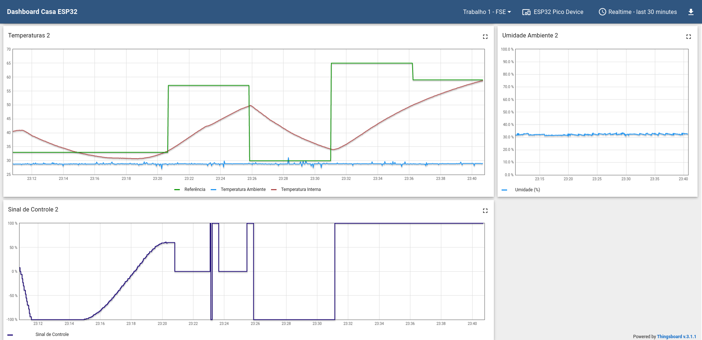
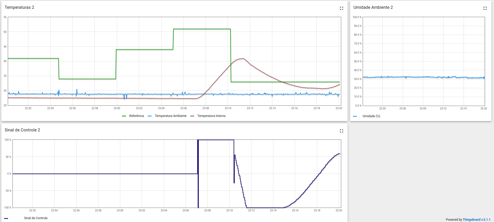

# FSE - Projeto 1

## Objetivo

- Realizar o controle de temperatura de um ambiente fechado, através dos métodos de On / Off e PID.
- Fazer a medição da temperatura interna em comparação com a temperatura ambiente e a temperatura de referência.
- Fazer o controle do programa através da chave física no modelo ou pelo terminal.

## Como executar

Para executar o programa, é necessário executar o comando abaixo na pasta raiz do trabalho.

```bash
    make
```

Após compilado, basta executar:

```bash
    ./bin/bin
```

## Modo de Uso

### **Terminal**

Para alternar os métodos entre PID e On / Off basta pressionar: `CTRL + \`

### **Chave**

Para trocar a lógica de controle, altere o nível da chave física conectada ao sistema.

Para encerrar o programa de forma segura, basta executar:

```
CTRL + C
```

## Gráficos

### **ON / OFF**

A medição com o método ON/ OFF foi feita por 15 minutos, entre 23h25 e 23h40.



### **PID**

A medição com o método PID foi feita por 10 minutos, entre 23h10 e 23h20


